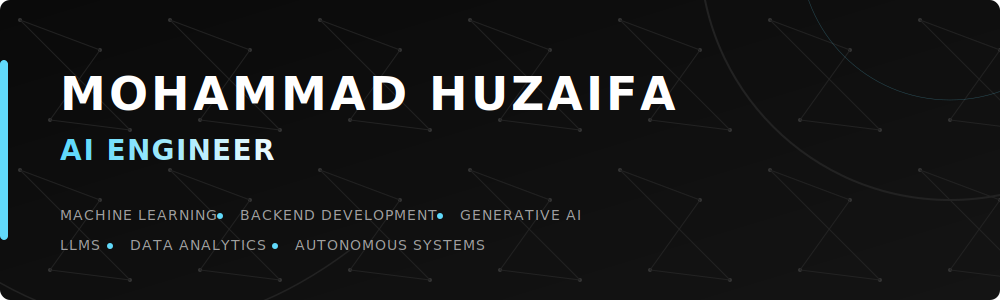
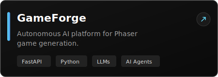
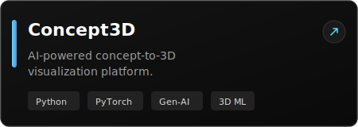
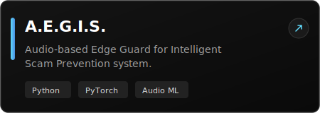
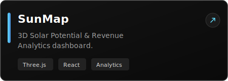
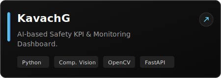

  

   

  

 

  

    I am an <b>AI Engineer</b> and <b>Backend Developer</b> specializing in Machine Learning, Generative AI, and Scalable Backend Systems. My focus is on turning complex architectural ideas into practical, high-performance software through AI, robust engineering, and thoughtful design.
  

  

## 👤 About Me

- 🎓 Pursuing **B.Tech in Computer Science & Engineering** at **Dr. A.P.J. Abdul Kalam Technical University (AKTU)**.
- 💼 Currently working as a **Full-Time Backend Developer** at **Sanfy Consultancy Services**.
- 🧠 Deeply focused on **Machine Learning, LLMs, Generative AI, and Computer Vision**.
- 🛠 Building robust **Backend Systems, Product Engineering solutions, and Workflow Automation**.

  

## 💼 Experience

### **Backend Developer** @ Sanfy Consultancy Services
*Focus: Backend APIs • Automation • Scalable Systems*

  

## 🎯 Current Focus

  <kbd>GameForge</kbd> &nbsp;&nbsp;
  <kbd>Concept3D</kbd> &nbsp;&nbsp;
  <kbd>Retrieval-Augmented Generation (RAG)</kbd> &nbsp;&nbsp;
  <kbd>LLMs</kbd> &nbsp;&nbsp;
  <kbd>Autonomous AI</kbd> &nbsp;&nbsp;
  <kbd>Backend Engineering</kbd>

  

## 🚀 Featured Projects

  
  &nbsp;&nbsp;
  
  
    
  
  
  &nbsp;&nbsp;
  

    
  
  

  

## 🛠 Tech Stack

### Programming

  
  
  
  

### Artificial Intelligence & ML

  
  
  
  
  
  

### Backend & Frameworks

  

### Databases & Tools

  
  
  
  
  
  

  

## 📊 Analytics & Metrics

  
  

 

  

 

  

 

  

 

 

  

  

## 📫 Connect With Me

  
  
  
  

 

  

  

  
<i>"Turning ideas into practical software through AI, engineering, and thoughtful design."</i>

