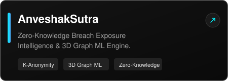
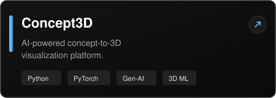
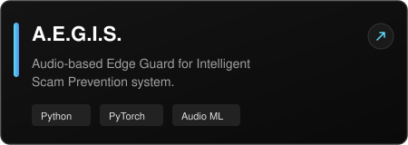
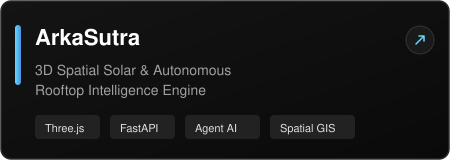
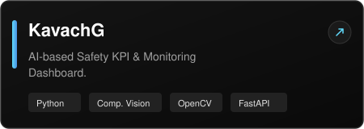
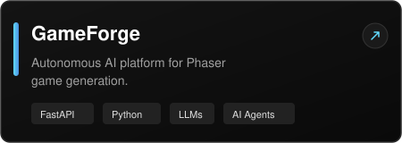

  

   

  

 

  

    I am an <b>Agentic AI Engineer</b> and <b>Backend Developer</b> specializing in Autonomous Agents, Generative AI, Scalable Backend Systems, and Data Engineering. My focus is on turning complex architectural ideas into practical, high-performance software through AI, robust engineering, and thoughtful design.
  

  

## About Me

- **Education:** Pursuing **B.Tech in Computer Science & Engineering** at **Dr. A.P.J. Abdul Kalam Technical University (AKTU)**.
- **Experience:** Completed **Backend Developer Internship** at **Sanfy Consultancy Services (Orvanto AI)** (Apr 2026 – Jul 2026).
- **Core Focus:** Deeply focused on **Machine Learning, LLMs, Generative AI, and Computer Vision**.
- **Specialization:** Building robust **Backend Systems, Product Engineering solutions, and Workflow Automation**.

  

## Experience

### **Backend Developer Intern** @ Sanfy Consultancy Services (Orvanto AI)
*Apr 2026 – Jul 2026 • Backend APIs • Automation • Scalable Systems*

- **Backend APIs:** Designed and optimized high-throughput REST APIs and backend infrastructure using Python, FastAPI, and SQL.
- **Automation Workflows:** Engineered custom n8n automation workflows and Docker environments to streamline data ingestion and system processes.
- **Collaboration & Support:** Collaborated with the product team to debug complex systems, integrate third-party APIs, and resolve database bottlenecks.

  

## Current Focus

  <kbd>AnveshakSutra</kbd> &nbsp;&nbsp;
  <kbd>Concept3D</kbd> &nbsp;&nbsp;
  <kbd>Agentic AI &amp; Multi-Agent Swarms</kbd> &nbsp;&nbsp;
  <kbd>Zero-Knowledge Privacy</kbd> &nbsp;&nbsp;
  <kbd>3D Spatial Simulation</kbd> &nbsp;&nbsp;
  <kbd>Distributed Backend Architecture</kbd>

  

## Featured Production Systems

  
  &nbsp;&nbsp;
  
  
    
  
  
  &nbsp;&nbsp;
  

    
  
  
  &nbsp;&nbsp;
  

 

###  Complete Production Systems & Repositories Directory

| Production System | Category | Core Tech Stack | Live Preview | Repository |
| :--- | :--- | :--- | :--- | :--- |
| **AnveshakSutra** | Zero-Knowledge Breach OSINT &amp; Deception | K-Anonymity • 3D Graph ML • Celery • WebGL | [**Live Preview**](https://anveshak-sutra.vercel.app/) | [GuruMachanica/AnveshakSutra](https://github.com/GuruMachanica/AnveshakSutra) |
| **Concept-3D** | Prompt-to-3D Spatial Latent Generation | PyTorch • Generative 3D • ChromaDB • Three.js | [**Live Preview**](https://concept-3d.vercel.app/) | [GuruMachanica/Concept-3D](https://github.com/GuruMachanica/Concept-3D) |
| **A.E.G.I.S.** | Real-Time Audio Edge Scam Defense | FastAPI • AASIST • WebSockets • Sarvam STT | [**Live Preview**](https://aegis-anti-scam.netlify.app/) | [GuruMachanica/A.E.G.I.S.](https://github.com/GuruMachanica/A.E.G.I.S.) |
| **SunMap** | 3D Spatial Solar Irradiance Engine | Three.js • CityGML LOD2 • Perez Transposition | [**Live Preview**](https://sunmapsolar.netlify.app/) | [GuruMachanica/SunMap](https://github.com/GuruMachanica/SunMap) |
| **KavachG** | Autonomous Edge Industrial Safety CV | YOLOv8 • 17-Point Pose • Three.js Plant Twin | [**Live Preview**](https://kavach-g.vercel.app/) | [GuruMachanica/KavachG](https://github.com/GuruMachanica/KavachG) |
| **Portfolio &amp; Resume** | Monolith Interactive Web Portfolio | React 18 • Three.js • Anime.js • TailwindCSS | [**Live Web**](https://mohammad-huzaifa.me/) • [**Resume**](https://mohammad-huzaifa.me/resume) | [GuruMachanica/Portfolio](https://github.com/GuruMachanica/Portfolio) |
| **Giyu-Bot** | Autonomous Telegram AI Assistant with pgvector RAG | Python • Mistral AI • Supabase • Telegram API | [**@TomiokaGiyu98_bot**](https://t.me/TomiokaGiyu98_bot) | [GuruMachanica/Giyu-Bot](https://github.com/GuruMachanica/Giyu-Bot) |
| **ArthaRaksa** | Zero-Knowledge Anti-Phishing Ecosystem | Int4 Transformer • Bloom Filter • Fastify | — | [GuruMachanica/ArthaRaksa](https://github.com/GuruMachanica/ArthaRaksa) |

  

## Tech Stack

### Generative AI &amp; Agentic Systems

  
  
  
  

### Programming

  
  
  
  

### Artificial Intelligence &amp; ML

  
  
  
  

### Backend &amp; Frameworks

  

### Databases &amp; Tools

  
  
  
  
  
  

  

## Analytics & Metrics

  
  

 

  

 

  
  &nbsp;&nbsp;
  

 

  

 

  

 

  

## Publications & Certifications

- **Research Paper:** [Physiochemical Pattern Fingerprinting (PPF): A Memory-Efficient Approach to Structurally-Sensitive Protein Homology Detection](https://impactfactor.org/PDF/IJDDT/16/IJDDT,Vol16,Issue43s,Article31.pdf)  
  *By Rohit Mishra, et al. (including Mohammad Huzaifa). Published in the International Journal of Drug Delivery Technology (IJDDT), Vol 16, Issue 4.*
- **Harvard Certification:** [CS50's Introduction to Artificial Intelligence with Python](https://cs50.harvard.edu/certificates/110613e9-87d7-4464-9897-63780847a793)

  

## Connect With Me

  
  
  
  

 

  

  

  
<i>"Turning ideas into practical software through AI, engineering, and thoughtful design."</i>

